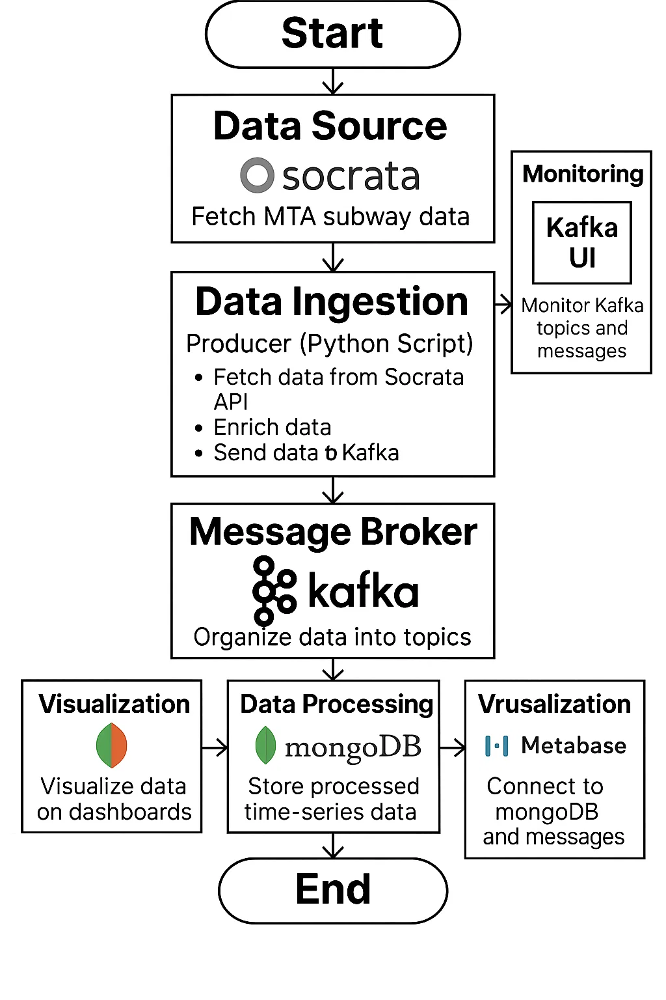

# RouteSavvy - Real-Time Subway Ridership Analyzer 🚇📊

**CS-GY 6513 Big Data Project**  
**Team Members:**  
- Krapa Karthik [NET ID: kk5754, NYU ID: N12039854]  
- Shreyansh Bhardwaj [NET ID: sb10261, NYU ID: N17664537]  
- Sourik Dutta [NET ID: sd5913, NYU ID: N19304628]  
- Dev Thakkar [NET ID: djt8795, NYU ID: N19070379]  

---

## 📌 Introduction
RouteSavvy addresses NYC subway commuters' challenges with real-time crowd analysis using MTA ridership data. Our system processes hourly updates from 472 subway stations to provide congestion-aware route recommendations through a scalable big data pipeline.

  
*Figure 1: End-to-End System Architecture*

---

## 🎯 Key Features
- **Real-time Processing**: 60,000+ hourly records analyzed via PySpark Streaming
- **Crowd Prediction**: Peak-hour detection and transfer pattern analysis
- **Visual Analytics**: Interactive dashboards showing station-level congestion
- **Scalable Infrastructure**: Dockerized deployment with Kafka and Spark clusters

---

## 📂 Dataset
**MTA Subway Hourly Ridership (2020-2024)**  

| Attribute            | Description                          | Type      |
|----------------------|--------------------------------------|-----------|
| `transit_timestamp`  | Hourly timestamp (UTC)               | DateTime  |
| `station_complex`    | Station name with served lines       | String    |
| `ridership`          | Hourly entries count                 | Integer   |
| `transfers`          | Inter-line transfers                 | Float     |
| `payment_method`     | OMNY/MetroCard usage                 | Categorical|

**Enrichment Features Added:**
- Peak-hour flags (7-9AM, 4-7PM)
- Transfer ratios
- Cumulative ridership metrics

---

### Core Components
1. **Ingestion Layer**
   - Python scripts using Sodapy client
   - Kafka producers with Gzip compression
2. **Processing Layer**
   - PySpark windowed aggregations
   - Peak-hour detection logic
3. **Storage**
   - MongoDB document store
   - Timeseries collections for efficient querying
4. **Visualization**
   - Metabase dashboards with geo-spatial views

---

## 🚀 Deployment
### Dockerized Services
Start the stack

docker-compose up -d --scale spark-worker=3